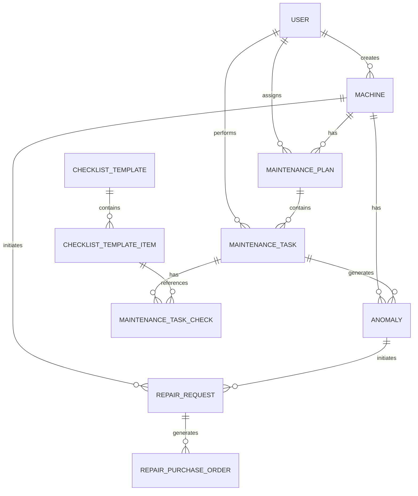
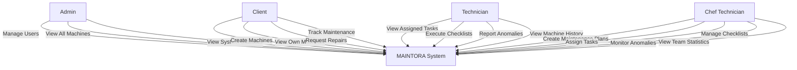
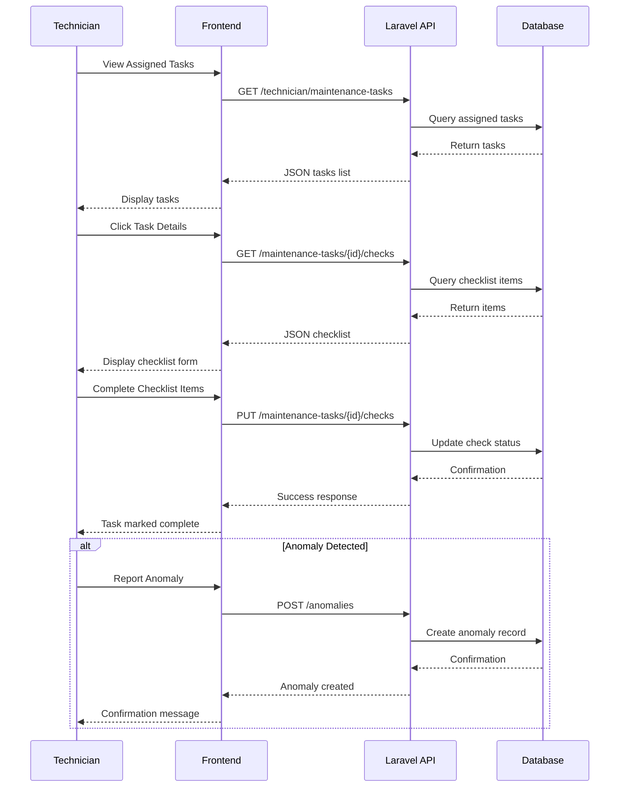
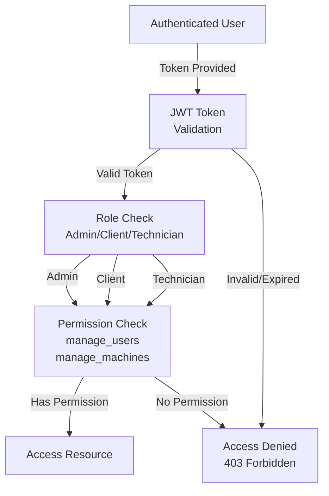
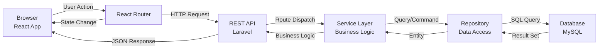

# MAINTORA - Computerized Maintenance Management System

## Project Overview

MAINTORA is a comprehensive Computerized Maintenance Management System (CMMS) designed to streamline industrial asset maintenance operations. The platform provides organizations with an integrated solution for managing machines, scheduling preventive maintenance, tracking anomalies, and managing repair requests across multiple operational roles.

The system solves critical challenges in industrial maintenance by:

- Centralizing machine and asset information with geolocation tracking
- Automating maintenance scheduling and task assignment
- Enabling real-time anomaly detection and reporting
- Facilitating repair request workflows with purchase order management
- Supporting role-based access control for different stakeholder groups
- Providing comprehensive audit trails and historical data tracking

MAINTORA is built on a modern technology stack with a scalable architecture supporting multiple user roles: Administrators, Clients, Technicians, and Chef Technicians.

## Tech Stack

### Frontend

- **React 19.2.4** - Modern UI library with hooks support
- **TypeScript 5.9.3** - Type-safe JavaScript superset
- **React Router 7.14.0** - Client-side routing and navigation
- **React Hook Form 7.72.1** - Efficient form state management
- **Tailwind CSS 4.2.2** - Utility-first CSS framework
- **Vite 8.0.1** - Next-generation build tool for fast development
- **MapLibre GL 5.23.0** - Open-source mapping library for geolocation visualization
- **Turf.js 7.3.4** - Geospatial analysis library
- **ESLint 9.39.4** - Code linting and quality analysis

### Backend

- **Laravel 13.0** - Robust PHP web application framework
- **PHP 8.3** - High-performance server-side language
- **JWT Authentication (tymon/jwt-auth 2.9)** - Stateless token-based authentication
- **Spatie Permission 7.2** - Advanced role and permission management
- **Laravel Sanctum 4.0** - API token authentication
- **Pest 4.4** - Modern PHP testing framework
- **Laravel Pint 1.27** - PHP code formatter
- **Faker & Mockery** - Database seeding and mocking libraries

### Database

- **MySQL/PostgreSQL** - Relational database management
- **Eloquent ORM** - Laravel's expressive database abstraction layer
- **Schema Migrations** - Version-controlled database structure
- **Database Seeders** - Automated test data population

### Development & DevOps

- **Docker** - Containerization (optional)
- **Git** - Version control
- **Composer** - PHP dependency management
- **NPM** - Node.js package management
- **PostCSS/Autoprefixer** - CSS processing and optimization

## Architecture

### System Architecture Overview

```
┌─────────────────────────────────────────────────────────────┐
│                     CLIENT LAYER (Browser)                   │
│                    React + TypeScript + Vite                 │
└────────────────────────────┬────────────────────────────────┘
                             │
                    HTTP/REST API Requests
                             │
        ┌────────────────────┴─────────────────────┐
        │                                          │
┌───────▼────────────────────────────┐   ┌────────▼──────────────┐
│     API Gateway & Authentication   │   │  Static Assets        │
│     (JWT Token Validation)         │   │  (Public Directory)   │
└───────┬────────────────────────────┘   └───────────────────────┘
        │
        │ Route Dispatching
        │
    ┌───▼─────────────────────────────────────────────────────┐
    │          Laravel Application Server (Port 8000)          │
    │                                                           │
    │  ┌──────────────┐  ┌──────────────┐  ┌──────────────┐  │
    │  │  Controllers │  │  Services    │  │ Repositories │  │
    │  └──────────────┘  └──────────────┘  └──────────────┘  │
    │                                                           │
    │  ┌──────────────────────────────────────────────────┐  │
    │  │  Middleware Stack                                 │  │
    │  │  - Authentication (JWT)                           │  │
    │  │  - Authorization (Spatie Permission)              │  │
    │  │  - Role-based Access Control                      │  │
    │  │  - CORS Handling                                  │  │
    │  └──────────────────────────────────────────────────┘  │
    └───┬─────────────────────────────────────────────────────┘
        │
        │ Eloquent ORM
        │
┌───────▼────────────────────────────┐
│     Database Layer (MySQL)          │
│                                     │
│  - Users & Authentication           │
│  - Machines & Asset Management      │
│  - Maintenance Plans & Tasks        │
│  - Anomalies & Repairs              │
│  - Checklists & Templates           │
│  - Historical Data & Audit Logs     │
└─────────────────────────────────────┘
```

### Component Communication Flow

The system follows a clean separation of concerns:

1. **Frontend** - React components manage UI state and user interactions
2. **API Layer** - RESTful endpoints handle requests and return JSON responses
3. **Authentication** - JWT tokens validate user identity and permissions
4. **Authorization** - Spatie Permission middleware enforces role-based access
5. **Business Logic** - Service layer encapsulates complex operations
6. **Data Persistence** - Eloquent models interact with the database

### Request/Response Pattern

```
Request:
  Client → HTTP GET/POST/PUT/DELETE → Laravel Route

Processing:
  Route → Middleware (Auth/Auth) → Controller → Service → Repository → Model

Response:
  JSON → HTTP 200/201/400/403/404 → Client
```

## Features

### Global Features (All Authenticated Users)

- **Profile Management** - View and update user account details
- **Password Management** - Secure password change functionality
- **Authentication** - JWT-based token authentication with refresh capability
- **Session Management** - Automatic token expiration and refresh

### Admin Role

- **User Management** - Create, read, update, and delete system users
- **Role Assignment** - Assign roles and permissions to users
- **System Overview** - Access administrative dashboard with system statistics
- **Machine Registry** - View and manage all machines in the system
- **Machine History** - Track maintenance history and performance metrics
- **Access Control** - Manage user permissions and role definitions

### Client Role

- **Machine Management** - Create, view, update, and manage owned machines
- **Asset Tracking** - Monitor machine status (Active, Maintenance, Anomalous)
- **Geolocation Support** - Store and visualize machine locations on map
- **Maintenance History** - View detailed maintenance records for owned machines
- **Repair Requests** - Create and track repair requests for machines
- **Purchase Orders** - Generate and manage repair purchase orders
- **Dashboard** - Client-specific overview with key metrics

### Chef Technician Role

- **Maintenance Planning** - Create and manage maintenance cycles
- **Technician Assignment** - Assign maintenance tasks to technicians
- **Checklist Management** - Create and manage maintenance checklist templates
- **Anomaly Monitoring** - Track and manage machine anomalies
- **Repair Request Management** - Process and respond to repair requests
- **Team Oversight** - Monitor technician performance and workload
- **Dashboard** - Executive view with team statistics and KPIs

### Technician Role

- **Task Management** - View assigned maintenance tasks
- **Checklist Execution** - Complete maintenance checklists with real-time updates
- **Anomaly Reporting** - Report and document machine anomalies
- **Task History** - Access historical maintenance records
- **Machine Access** - View machine information and maintenance history

## Database Design

### Entity Relationship Diagram



### Core Tables

#### Users
- **id** (Primary Key)
- **first_name, last_name** - User identification
- **email** (Unique) - Authentication credential
- **phone** - Contact information
- **password** - Hashed credential
- **status** - Account status (active/inactive)
- **created_at, updated_at** - Timestamps
- **deleted_at** - Soft delete support

#### Machines
- **id** (Primary Key)
- **code** (Unique) - Asset identifier
- **name** - Machine designation
- **location** - Physical location description
- **latitude, longitude** - Geolocation coordinates
- **status** - Current state (active/maintenance/anomalous)
- **created_by** (Foreign Key to Users) - Creator reference
- **created_at, updated_at** - Timestamps

#### Maintenance Plans
- **id** (Primary Key)
- **machine_id** (Foreign Key) - Associated machine
- **assigned_to** (Foreign Key to Users) - Assigned technician
- **status** - Plan status (active/inactive)
- **repeat_unit** - Frequency unit (days/weeks/months)
- **repeat_every** - Frequency interval
- **created_at, updated_at** - Timestamps

#### Maintenance Tasks
- **id** (Primary Key)
- **maintenance_plan_id** (Foreign Key) - Parent plan
- **scheduled_date** - Planned execution date
- **status** - Task status (pending/in_progress/completed)
- **notes** - Task description and notes
- **created_at, updated_at** - Timestamps

#### Maintenance Task Checks
- **id** (Primary Key)
- **maintenance_task_id** (Foreign Key) - Parent task
- **checklist_template_item_id** (Foreign Key) - Checklist reference
- **status** - Check status (pending/passed/failed)
- **notes** - Observation notes
- **created_at, updated_at** - Timestamps

#### Anomalies
- **id** (Primary Key)
- **machine_id** (Foreign Key) - Affected machine
- **maintenance_task_id** (Foreign Key) - Detecting task
- **severity** - Level (low/medium/high)
- **description** - Anomaly details
- **status** - Resolution status
- **created_at, updated_at** - Timestamps

#### Repair Requests
- **id** (Primary Key)
- **anomaly_id** (Foreign Key) - Related anomaly
- **status** - Request status (open/in_progress/completed/rejected)
- **description** - Repair details
- **priority** - Urgency level
- **created_at, updated_at** - Timestamps

#### Checklist Templates
- **id** (Primary Key)
- **name** - Template designation
- **description** - Template purpose
- **created_at, updated_at** - Timestamps

#### Checklist Template Items
- **id** (Primary Key)
- **checklist_template_id** (Foreign Key) - Parent template
- **label** - Item description
- **order** - Execution sequence
- **created_at, updated_at** - Timestamps

#### Refresh Tokens
- **id** (Primary Key)
- **user_id** (Foreign Key) - Token owner
- **token** - Encoded refresh token
- **revoked** - Revocation flag
- **expires_at** - Token expiration
- **created_at, updated_at** - Timestamps

## API Design

### Authentication Endpoints

```
POST /api/login
  Request:
    {
      "email": "user@example.com",
      "password": "password123"
    }
  Response (200):
    {
      "access_token": "eyJhbGc...",
      "token_type": "Bearer",
      "expires_in": 3600
    }

POST /api/refresh
  Request:
    {
      "refresh_token": "..."
    }
  Response (200):
    {
      "access_token": "eyJhbGc...",
      "token_type": "Bearer",
      "expires_in": 3600
    }

POST /api/logout
  Response (200):
    {
      "message": "Logged out successfully"
    }
```

### User Profile Endpoints

```
GET /api/profile
  Response (200):
    {
      "id": 1,
      "first_name": "John",
      "last_name": "Doe",
      "email": "john@example.com",
      "phone": "+1234567890",
      "roles": [
        {"id": 1, "name": "technician"}
      ]
    }

PUT /api/profile
  Request:
    {
      "first_name": "John",
      "last_name": "Doe",
      "phone": "+1234567890"
    }
  Response (200):
    {
      "message": "Profile updated successfully",
      "data": { ... }
    }

PUT /api/profile/password
  Request:
    {
      "current_password": "oldpassword",
      "new_password": "newpassword"
    }
  Response (200):
    {
      "message": "Password updated successfully"
    }
```

### Admin Endpoints

```
GET /api/admin/dashboard
  Response (200):
    {
      "total_users": 50,
      "total_machines": 100,
      "active_maintenance_plans": 35,
      "pending_anomalies": 12
    }

GET /api/admin/users
  Response (200):
    {
      "data": [
        {
          "id": 1,
          "first_name": "Jane",
          "last_name": "Smith",
          "email": "jane@example.com",
          "roles": [...]
        }
      ],
      "pagination": { "total": 50, "per_page": 15, "current_page": 1 }
    }

POST /api/admin/users
  Request:
    {
      "first_name": "New",
      "last_name": "User",
      "email": "new@example.com",
      "phone": "+1234567890",
      "role": 3
    }
  Response (201):
    {
      "message": "User created successfully",
      "data": { ... }
    }

GET /api/admin/roles
  Response (200):
    {
      "data": [
        {"id": 1, "name": "admin"},
        {"id": 2, "name": "client"},
        {"id": 3, "name": "chef-technician"},
        {"id": 4, "name": "technician"}
      ]
    }

GET /api/admin/machines
  Response (200):
    {
      "data": [
        {
          "id": 1,
          "code": "MAC-001",
          "name": "Hydraulic Press",
          "location": "Factory A - Hall 1",
          "status": "active",
          "latitude": 48.8566,
          "longitude": 2.3522
        }
      ],
      "pagination": { ... }
    }
```

### Client Endpoints

```
GET /api/client/dashboard
  Response (200):
    {
      "machines_count": 25,
      "active_maintenance": 5,
      "pending_repairs": 3,
      "recent_anomalies": 2
    }

GET /api/client/machines
  Response (200):
    {
      "data": [
        {
          "id": 1,
          "code": "MAC-001",
          "name": "Machine Name",
          "status": "active"
        }
      ]
    }

POST /api/client/machines
  Request:
    {
      "code": "MAC-002",
      "name": "New Machine",
      "location": "Factory Location",
      "latitude": 48.8566,
      "longitude": 2.3522
    }
  Response (201):
    {
      "message": "Machine created successfully",
      "data": { ... }
    }

GET /api/client/repair-requests
  Response (200):
    {
      "data": [
        {
          "id": 1,
          "status": "open",
          "description": "Repair description",
          "priority": "high",
          "created_at": "2026-05-03T10:00:00Z"
        }
      ]
    }

POST /api/client/repair-requests/{id}/purchase-orders
  Request:
    {
      "total_cost": 5000,
      "parts": "List of parts",
      "notes": "Additional notes"
    }
  Response (201):
    {
      "message": "Purchase order created",
      "data": { ... }
    }
```

### Chef Technician Endpoints

```
GET /api/chef-technician/dashboard/statistics
  Response (200):
    {
      "total_technicians": 10,
      "active_tasks": 15,
      "completed_this_month": 45,
      "pending_anomalies": 8
    }

GET /api/chef-technician/maintenance-plans
  Response (200):
    {
      "data": [
        {
          "id": 1,
          "machine_id": 5,
          "assigned_to": 7,
          "status": "active",
          "repeat_unit": "weeks",
          "repeat_every": 2
        }
      ]
    }

POST /api/chef-technician/maintenance-plans
  Request:
    {
      "machine_id": 5,
      "assigned_to": 7,
      "status": "active",
      "repeat_unit": "weeks",
      "repeat_every": 2
    }
  Response (201):
    {
      "message": "Maintenance plan created",
      "data": { ... }
    }

GET /api/chef-technician/anomalies
  Response (200):
    {
      "data": [
        {
          "id": 1,
          "machine_id": 5,
          "severity": "high",
          "status": "open",
          "created_at": "2026-05-03T10:00:00Z"
        }
      ]
    }

GET /api/chef-technician/checklist/templates
  Response (200):
    {
      "data": [
        {
          "id": 1,
          "name": "Monthly Maintenance",
          "items": [...]
        }
      ]
    }
```

### Technician Endpoints

```
GET /api/technician/maintenance-tasks
  Response (200):
    {
      "data": [
        {
          "id": 1,
          "maintenance_plan_id": 3,
          "scheduled_date": "2026-05-10",
          "status": "pending"
        }
      ]
    }

GET /api/technician/maintenance-tasks/{id}/checks
  Response (200):
    {
      "data": [
        {
          "id": 1,
          "checklist_item": "Check oil level",
          "status": "pending",
          "notes": null
        }
      ]
    }

PUT /api/technician/maintenance-tasks/{id}/checks/{checkId}
  Request:
    {
      "status": "passed",
      "notes": "Oil level normal"
    }
  Response (200):
    {
      "message": "Check updated",
      "data": { ... }
    }

POST /api/technician/anomalies/{id}/repair-requests
  Request:
    {
      "description": "Repair needed for anomaly",
      "priority": "high"
    }
  Response (201):
    {
      "message": "Repair request created",
      "data": { ... }
    }
```

### Standard Response Format

All API responses follow a consistent JSON structure:

```json
{
  "success": true,
  "message": "Operation completed successfully",
  "data": { ... },
  "errors": null
}
```

Error responses:

```json
{
  "success": false,
  "message": "Operation failed",
  "data": null,
  "errors": {
    "field_name": ["Error message"]
  }
}
```

### Authentication Flow

```
1. User Login
   POST /api/login with credentials
   → Receive access_token and refresh_token

2. API Request
   GET /api/profile
   Header: Authorization: Bearer {access_token}

3. Token Validation
   Middleware validates JWT token
   → Decode token and verify signature
   → Check token expiration

4. Permission Check
   Middleware validates user role/permissions
   → Check if user has required permission
   → Allow or deny request

5. Token Refresh
   When access_token expires:
   POST /api/refresh with refresh_token
   → Receive new access_token

6. Logout
   POST /api/logout
   → Token added to blacklist
   → Session terminated
```

## System Diagrams

### Use Case Diagram



### Maintenance Task Execution Sequence Diagram



### Role-Based Access Control Diagram



### Data Flow Diagram



## Installation Guide

### Prerequisites

- PHP 8.3 or higher
- Node.js 18.0 or higher
- Composer
- NPM or Yarn
- MySQL 8.0 or PostgreSQL 12+
- Git

### Backend Setup

1. **Navigate to backend directory:**

```bash
cd BACK-END
```

2. **Install PHP dependencies:**

```bash
composer install
```

3. **Create environment configuration:**

```bash
cp .env.example .env
```

4. **Generate application key:**

```bash
php artisan key:generate
```

5. **Configure database in .env file:**

```env
DB_CONNECTION=mysql
DB_HOST=127.0.0.1
DB_PORT=3306
DB_DATABASE=maintora
DB_USERNAME=root
DB_PASSWORD=your_password

JWT_SECRET=your_jwt_secret_key
JWT_ALGORITHM=HS256
JWT_TTL=60
JWT_REFRESH_TTL=20160
```

6. **Run database migrations:**

```bash
php artisan migrate
```

7. **Seed initial data (optional):**

```bash
php artisan db:seed
```

8. **Start Laravel development server:**

```bash
php artisan serve
```

The backend will be available at `http://localhost:8000`

### Frontend Setup

1. **Navigate to frontend directory:**

```bash
cd FRONT-END
```

2. **Install Node dependencies:**

```bash
npm install
```

3. **Create environment configuration:**

Create a `.env` file in the frontend root:

```env
VITE_API_BASE_URL=http://localhost:8000/api
VITE_APP_NAME=MAINTORA
```

4. **Start development server:**

```bash
npm run dev
```

The frontend will be available at `http://localhost:5173`

5. **Build for production:**

```bash
npm run build
```

### Full Project Setup (Single Command)

Alternatively, use the setup script in the backend:

```bash
composer run setup
```

This command will:
- Install PHP dependencies
- Create `.env` file
- Generate application key
- Run migrations
- Install NPM dependencies
- Build frontend assets

### Running Both Servers in Development

From the backend directory, use the development command:

```bash
composer run dev
```

This will concurrently run:
- Laravel development server
- Queue listener
- Log tail
- Vite development server
- Frontend watch mode

### Database Seeding

To populate the database with test data:

```bash
php artisan db:seed
```

Or seed specific seeders:

```bash
php artisan db:seed --class=RoleSeeder
php artisan db:seed --class=UserSeeder
php artisan db:seed --class=MachineSeeder
```

## Usage

### Accessing the Application

1. **Open your browser** and navigate to `http://localhost:5173`
2. **Login** with your credentials
3. **Select your role** upon first access

### User Workflows

#### Admin Workflow

1. Login as admin
2. Navigate to Admin Dashboard
3. Create and manage system users
4. Assign roles and permissions
5. View all machines across the system
6. Monitor system statistics

#### Client Workflow

1. Login as client
2. View Client Dashboard
3. Create new machines with geolocation
4. Assign machines to maintenance plans
5. Monitor maintenance history
6. Create repair requests
7. Generate purchase orders
8. Track repair status

#### Chef Technician Workflow

1. Login as chef technician
2. View Team Dashboard
3. Create maintenance plans for machines
4. Assign tasks to technicians
5. Create and manage checklist templates
6. Monitor machine anomalies
7. Process repair requests
8. View team performance statistics

#### Technician Workflow

1. Login as technician
2. View assigned maintenance tasks
3. Execute checklist items
4. Record observations and notes
5. Report anomalies if detected
6. Update task status upon completion
7. View historical task records

### Example: Creating a Maintenance Plan

1. Login as Chef Technician
2. Navigate to Maintenance Plans
3. Click "Create New Plan"
4. Select target machine
5. Choose assigned technician
6. Set repetition frequency (e.g., every 2 weeks)
7. Activate the plan
8. System automatically generates maintenance tasks
9. Technicians receive task assignments

### Example: Reporting an Anomaly

1. Login as Technician
2. Start maintenance task
3. Execute checklist items
4. If issue detected, click "Report Anomaly"
5. Fill anomaly details:
   - Severity level (low/medium/high)
   - Description
   - Photos/documentation
6. Submit anomaly
7. Chef technician receives notification
8. Chef technician creates repair request
9. Repair workflow is initiated

## Project Structure

### Backend Structure

```
BACK-END/
├── app/
│   ├── Console/               # Artisan commands
│   ├── Http/
│   │   ├── Controllers/       # Request handlers by feature
│   │   │   ├── Admin/
│   │   │   ├── Client/
│   │   │   ├── Technician/
│   │   │   ├── ChefTechnician/
│   │   │   └── Auth/
│   │   ├── Middleware/        # Request filtering (Auth, CORS, etc)
│   │   ├── Requests/          # Form request validation
│   │   └── Resources/         # API response transformers
│   ├── Models/                # Eloquent models
│   ├── Services/              # Business logic layer
│   ├── Repositories/          # Data access abstraction
│   ├── Mail/                  # Email notifications
│   ├── Providers/             # Service container bindings
│   └── Events/                # Application events
│
├── bootstrap/
│   ├── app.php               # Application bootstrap
│   ├── providers.php         # Service provider registration
│   └── cache/                # Bootstrap cache
│
├── config/                    # Configuration files
│   ├── app.php
│   ├── auth.php
│   ├── database.php
│   ├── jwt.php               # JWT configuration
│   ├── permission.php        # Spatie permission config
│   └── mail.php
│
├── database/
│   ├── migrations/           # Database schema migrations
│   ├── seeders/              # Database seeders
│   └── factories/            # Model factories for testing
│
├── routes/
│   ├── api.php               # API routes
│   ├── web.php               # Web routes
│   └── console.php           # Console routes
│
├── resources/
│   ├── views/                # Blade templates (if used)
│   ├── css/                  # CSS assets
│   └── js/                   # JavaScript assets
│
├── storage/
│   ├── app/                  # Application files
│   ├── logs/                 # Application logs
│   └── framework/            # Framework cache
│
├── tests/
│   ├── Feature/              # Feature tests
│   ├── Unit/                 # Unit tests
│   └── TestCase.php          # Test base class
│
├── public/
│   ├── index.php             # Application entry point
│   └── robots.txt
│
├── composer.json             # PHP dependencies
├── .env.example              # Environment template
├── artisan                   # Artisan CLI
└── phpunit.xml               # Testing configuration
```

### Frontend Structure

```
FRONT-END/
├── src/
│   ├── app/                  # Application initialization
│   │   ├── layouts/          # Layout components
│   │   ├── router/           # Route definitions
│   │   ├── styles/           # Global styles
│   │   └── utils/            # Utility functions
│   │
│   ├── features/             # Feature modules
│   │   ├── user/
│   │   │   ├── components/   # Reusable components
│   │   │   ├── pages/        # Feature pages
│   │   │   └── hooks/        # Custom React hooks
│   │   ├── machine/
│   │   ├── maintenance-plan/
│   │   ├── checklist-template/
│   │   └── ...
│   │
│   ├── modules/              # Role-based modules
│   │   ├── admin/
│   │   │   ├── pages/        # Admin pages
│   │   │   └── components/
│   │   ├── client/
│   │   ├── technician/
│   │   ├── chef-technician/
│   │   └── guest/
│   │
│   ├── shared/               # Shared components
│   │   ├── components/       # Reusable UI components
│   │   ├── hooks/            # Custom hooks
│   │   ├── types/            # TypeScript types
│   │   └── utils/            # Utility functions
│   │
│   ├── context/              # React context
│   │   └── AuthContext.tsx   # Authentication state
│   │
│   ├── main.tsx              # Application entry point
│   └── index.css             # Global styles
│
├── public/                   # Static assets
├── index.html                # HTML template
├── vite.config.ts            # Vite configuration
├── tsconfig.json             # TypeScript configuration
├── eslint.config.js          # ESLint configuration
├── package.json              # Node dependencies
└── README.md                 # Frontend documentation
```

## Best Practices

### Architecture & Design Patterns

- **Repository Pattern** - Data access layer abstraction for testability
- **Service Layer Pattern** - Encapsulates complex business logic
- **Dependency Injection** - Loose coupling through container binding
- **Role-Based Access Control** - Granular permission management via Spatie
- **Component-Based Architecture** - Modular, reusable React components
- **Feature-Based Organization** - Organized by business domain, not technical layer

### Backend Code Standards

- **PSR-12 Compliance** - PHP Standard Recommendation coding standards
- **TypeHint All Methods** - Explicit parameter and return types
- **Eloquent Over Raw SQL** - Use ORM for queries
- **Meaningful Names** - Clear, descriptive naming conventions
- **Single Responsibility** - One class, one reason to change
- **DRY Principle** - Don't Repeat Yourself
- **Validation Layer** - Form requests for input validation
- **Error Handling** - Comprehensive exception handling
- **Logging** - All significant operations logged
- **Testing** - Pest framework for comprehensive test coverage

### Frontend Code Standards

- **Functional Components** - React hooks-based architecture
- **TypeScript Strict Mode** - Type-safe JavaScript development
- **Custom Hooks** - Reusable logic extraction
- **Props Validation** - Type-safe component interfaces
- **React Hook Form** - Efficient form state management
- **Tailwind CSS** - Utility-first styling approach
- **Naming Conventions** - PascalCase for components, camelCase for functions
- **Component Composition** - Single responsibility components
- **Error Boundaries** - Graceful error handling
- **Code Splitting** - Lazy-loaded route components

### Security Practices

- **JWT Tokens** - Stateless authentication with token expiration
- **CORS Configuration** - Restrict cross-origin requests
- **Input Validation** - Server-side validation of all inputs
- **Password Hashing** - Bcrypt hashing algorithm
- **SQL Injection Prevention** - Parameterized queries via Eloquent
- **XSS Prevention** - Template escaping and sanitization
- **CSRF Protection** - Token-based CSRF protection
- **Permission Checks** - Authorization middleware on all protected routes
- **Rate Limiting** - Throttle requests to prevent abuse
- **Secure Headers** - HTTPS, HSTS, X-Frame-Options configuration

### Database Optimization

- **Query Optimization** - Use eager loading to prevent N+1 queries
- **Indexing Strategy** - Index foreign keys and frequently queried columns
- **Soft Deletes** - Preserve data integrity with soft deletion
- **Migrations** - Version-controlled schema changes
- **Backups** - Regular automated backups
- **Connection Pooling** - Efficient database connection management

### Development Workflow

- **Git Flow** - Feature branches, pull requests, code review
- **Commit Messages** - Clear, descriptive commit messages
- **Code Review** - Peer review before merging
- **Testing** - Unit, feature, and integration tests
- **Documentation** - Inline comments and API documentation
- **Logging** - Structured logging for debugging
- **Performance Monitoring** - Monitor response times and resource usage

## Future Improvements

### Short-term Enhancements

- **Real-time Notifications** - WebSocket integration for live updates
- **Mobile Application** - Native mobile app (iOS/Android)
- **Offline Support** - Progressive web app capabilities
- **Advanced Reporting** - Customizable reports and dashboards
- **Predictive Maintenance** - ML-based anomaly prediction
- **Equipment Scheduling** - Conflict detection for resource allocation
- **Integration APIs** - Third-party system integration (ERP, CRM)

### Medium-term Enhancements

- **Document Management** - Upload and store machine documentation
- **QR Code Support** - Machine identification via QR codes
- **IoT Integration** - Real-time sensor data ingestion
- **Audit Trail** - Complete action logging and compliance reporting
- **Multi-language Support** - Internationalization (i18n)
- **Advanced Analytics** - Machine learning insights and trends
- **Workflow Automation** - Conditional task automation

### Long-term Enhancements

- **Microservices Architecture** - Scale specific components independently
- **AI Assistant** - Intelligent maintenance recommendations
- **Blockchain Integration** - Immutable maintenance records
- **Augmented Reality** - AR-guided maintenance procedures
- **Advanced Geolocation** - Route optimization for technicians
- **Energy Optimization** - Monitor and optimize machine energy consumption
- **Supply Chain Integration** - Automated spare parts ordering

## Technology Roadmap

### Q3 2026
- Real-time notification system
- Mobile application (beta)
- Advanced analytics dashboard

### Q4 2026
- IoT sensor integration
- Predictive maintenance models
- Enhanced reporting module

### Q1 2027
- Multi-language support
- Document management system
- Third-party API integrations

### Q2 2027
- Microservices migration
- AI-powered insights
- Mobile app production release

## Conclusion

MAINTORA represents a comprehensive solution for industrial maintenance management, combining modern technologies with proven software architecture principles. The system's role-based access control, comprehensive API design, and modular architecture provide a scalable foundation for organizations to efficiently manage their maintenance operations.

The platform's clean separation between frontend and backend, combined with strong typing, automated testing, and adherence to design patterns, ensures maintainability and extensibility for future enhancements. By implementing best practices in security, performance, and user experience, MAINTORA delivers a professional-grade maintenance management system suitable for enterprises of all sizes.

For questions, contributions, or support, please refer to the project documentation or contact the development team.

---

**Version:** 1.0.0  
**Last Updated:** May 3, 2026  
**Maintained by:** MAINTORA Development Team  
**License:** MIT
